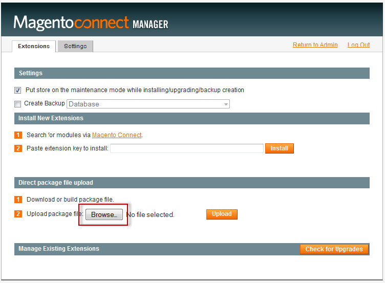
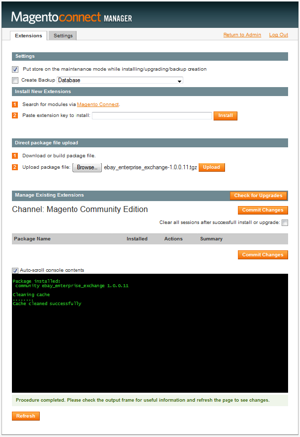
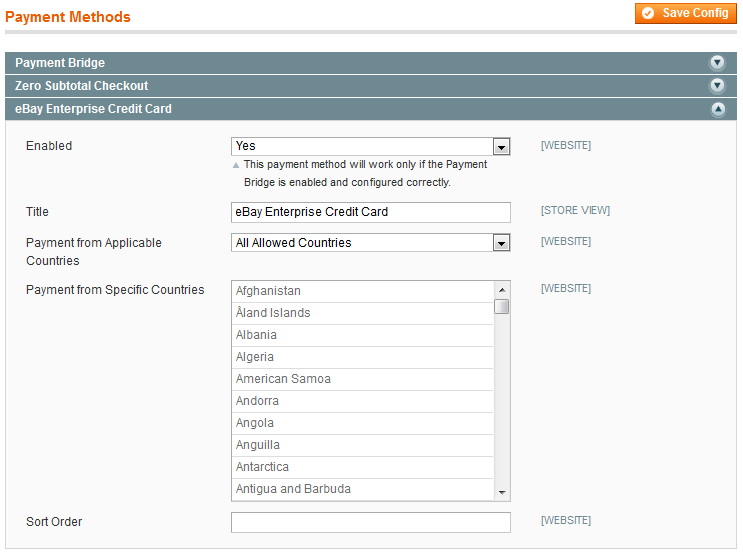
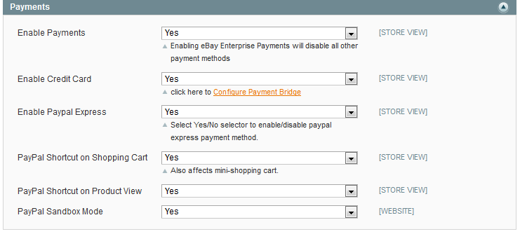
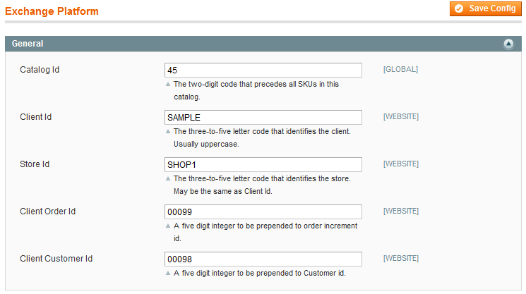
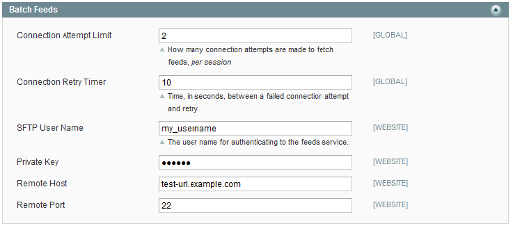
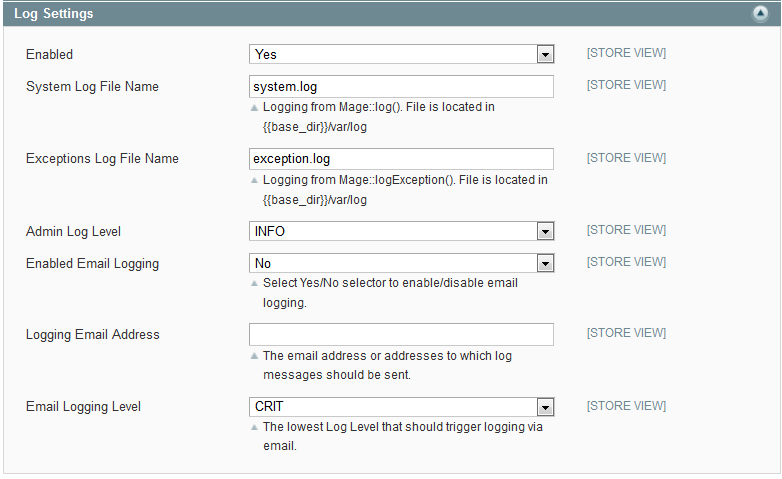

# eBay Enterprise Retail Order Management: Magento Extension Integration, Installation, and Configuration Guide

## Contents

This guide contains the following information:

1.  [Overview](#overview)
1.  [Prerequisites](#prerequisites)
1.  [Configuring XML for Batch Feeds](#configuring-xml-for-batch-feeds)
1.  [Configuring Local XML](#configuring-local-xml)
1.  [Configuring the Magento Payment Bridge and eBay Enterprise Retail Order Management Payments](#configuring-the-magento-payment-bridge-and-ebay-enterprise-retail-order-management-payments)
1.  [Scheduling Batch Feeds](#scheduling-batch-feeds)

## Overview

This guide discusses how you integrate with eBay Enterprise Retail Order Management to enable a Magento instance to:

-   Periodically synchronize product data with eBay Enterprise Retail Order Management (this includes product metadata, inventory, attributes, and attribute sets)
-   Map the Magento shipping method (such as `flatrate_flatrate`) to an eBay Enterprise shipping method
-   Specify valid ranges for stored value cards

### Understanding the Integration

The following figure shows a basic overview of the integration between Magento and eBay Enterprise Retail Order Management:


Data flows work as follows:

1.  Product data (whose structure is defined by the XML feeds) flows as follows:
    1.  To the product hub.
    1.  Data is stored in both the data warehouse and order management system.
1.  Inventory data flows as follows:
    1.  Inventory is managed by the order management system.
    1.  Available inventory is communicated to storefront using the fulfillment hub.
1.  Order transactions flow as follows:
    1.  Requests to eBay Retail Order Management arrive through a secure gateway.
    1.  eBay interfaces route requests to the appropriate service: order service, inventory service, tax service, address validation service, or payment service.
    1.  Orders and inventory updates go to the order management system bidirectionally.
    1.  Ordered items can be processed by the fulfillment hub or by the fulfillment channel you select.

Note the following:

-   Batch processes are shown in the preceding figure as dashed lines. Batch processes run every 15 minutes provided your [Magento cron job](http://www.magentocommerce.com/knowledge-base/entry/ce18-and-ee113-installing#install-cron) is set up.
-   Fulfillment is beyond the scope of this document. eBay Enterprise can assist you understanding your fulfillment options.

### Services Provided by Magento and by eBay Enterprise

Magento enables you to:

-   Configure the eBay Enterprise Retail Order Management extension to communicate with eBay Enterprise Retail Order Management through its secure gateway.
-   Configure options to interact with the eBay Enterprise Platform (tax, payments, address validation, and so on).
-   If eBay Enterprise Payments is enabled, to authorize transactions.
-   Create products, attributes, attribute sets, and so on.
     You must update the XML feeds if you make changes to the structure of this data.

eBay Enterprise Retail Order Management performs the following:

-   Address validation
-   Tax calculation
-   Inventory management
-   If you enabled eBay Enterprise Payments, it performs the following:
    -   Capture
    -   Refund
    -   Cancel
-   Fulfillment (if you subscribed to it) You have several options for order fulfillment, all of which are beyond the scope of this document.

### For More Information

For more detailed information about eBay Enterprise Retail Order Management, see the [Retail Order Management](http://www.ebayenterprise.com/commerce_technologies/exchange_platform.php) overview on [ebayenterprise.com](http://www.ebayenterprise.com).

## Implementation Roadmap

The following table provides high-level guidance about the tasks to integrate Magento with eBay Enterprise and who performs those tasks.

<table>
<col width="25%" />
<col width="25%" />
<col width="25%" />
<col width="25%" />
<tbody>
<tr class="odd">
<td align="left"><p><strong>Task</strong></p></td>
<td align="left"><p><strong>Role</strong></p></td>
<td align="left"><p><strong>Description</strong></p></td>
<td align="left"><p><strong>More information</strong></p></td>
</tr>
<tr class="even">
<td align="left"><p>1. Set up XML feeds</p></td>
<td align="left"><p>System Integrator</p></td>
<td align="left"><p>Set up the feed XML files on the eBay Enterprise server</p></td>
<td align="left"><p>eBay Enterprise will assist you.</p></td>
</tr>
<tr class="odd">
<td align="left"><p>2. Install the eBay Enterprise Retail Order Management extension</p></td>
<td align="left"><p>System Integrator or Magento administrator</p></td>
<td align="left"><p>Install the extension and make sure it installed correctly.</p></td>
<td align="left"><p>This guide</p></td>
</tr>
<tr class="even">
<td align="left"><p>3. Configure the extension</p></td>
<td align="left"><p>Magento administrator with assistance from the System Integrator</p></td>
<td align="left"><ul>
<li>System Integrator configures payments</li>
<li>Magento administrator configures everything else</li>
</ul></td>
<td align="left"><ul>
<li>System Integrator consults the eBay Enterprise Platform Integrator's Guide</li>
<li>Magento administrator consults this guide</li>
</ul></td>
</tr>
<tr class="odd">
<td align="left"><p>4. Run sandbox transactions</p></td>
<td align="left"><p>System Integrator or Magento administrator</p></td>
<td align="left"><ul>
<li>Using sample products and sandbox credentials supplied by eBay Enterprise, place orders in the Magento storefront and make sure the payments settle and that Magento inventory decrements.</li>
<li>Update inventory levels in eBay Enterprise and make sure Magento inventory increments.</li>
</ul></td>
<td align="left"><p>This guide</p></td>
</tr>
<tr class="even">
<td align="left"><p>5. Go live!</p></td>
<td align="left"><p>Magento administrator</p></td>
<td align="left"><p>Update your eBay Enterprise credentials as discussed in [Configuring the Magento Payment Bridge and eBay Enterprise Retail Order Management Payments](#configuring-the-magento-payment-bridge-and-ebay-enterprise-retail-order-management-payments) and start accepting orders.</p></td>
<td align="left"><p>This guide</p></td>
</tr>
</tbody>
</table>

## Prerequisites

This section discusses general prerequisites.

### Intended Audience

The intended audience for this guide is System Integrators with extensive experience with Magento and XML programming experience.

### System Prerequisites

-   The eBay Enterprise Retail Order Management extension is compatible with Magento EE 1.13.1 and later.
    -   If you're running an earlier version of Magento EE, see [Upgrading to and Verifying Magento Community Edition 1.8 and Enterprise Edition 1.13—Part 1](http://www.magentocommerce.com/knowledge-base/entry/ce18-and-ee113-upgrading).
-   The extension requires a patch to core Magento's Address Model so that the address validation service can work effectively. If you do not have this patch, contact eBay Enterprise.
-   In addition to Magento's standard system requirements, the eBay Enterprise Retail Order Management Magento extension requires the XSL and OpenSSL extensions to PHP. (These are often, but not always, enabled by default.)
-   The Magento Payment Bridge must be set up in a secure environment that is [Payment Application Data Security Standard (PA DSS) compliant](https://www.pcisecuritystandards.org/documents/pa-dss_v2.pdf).
-   The extension has been tested with PHP5.3.

### Required Information

You must have the following information from eBay Enterprise to start using eBay Enterprise Retail Order Management:

-   The eBay Enterprise mapping for the Magento shipping method (a typical Magento shipping method is `flatrate_flatrate`)
-   Valid number ranges for all the stored value cards your store accepts
-   API key
-   Store code

If you don't have all of this information, contact eBay Enterprise before continuing.

### Payment Bridge Documentation

Documentation for the Magento Payment Bridge is available on the Magento support portal as follows:

1.  Start a web browser and enter the following URL in its address or location field: [http://www.magento.com](http://www.magento.com)
1.  In the upper right corner, click **My Account**.
1.  Log in with the credentials provided to you by Magento.
1.  In the left navigation bar, click **Downloads**.
1.  In the right pane, click **Magento Payment Bridge**. The following figure shows an example.
        
1.  Click **Download** next to the document to download:
    1.  _Setting up Payment Methods for Use via Payment Bridge_
    1.  _Magento Payment Bridge 1.11.31.0 Administrative Guide_
    1.  _Magento Payment Bridge 1.11.31.0 PA-DSS Implementation Guide_
1.  Follow the prompts on your screen to download the desired documents.

**Note:** _Setting up Payment Methods for Use via Payment Bridge_ does not discuss setting up the eBay Enterprise Credit Card but it has useful information that applies to all payment methods.

### Installing the eBay Enterprise Retail Order Management extension

To install eBay Enterprise Retail Order Management extension:

1.  Download the eBay Enterprise Retail Order Management extension's tarball file from the eBay Enterprise partner portal.
1.  Log in to the Magento Admin Panel as an administrator.
1.  Click **System \> Magento Connect \> Magento Connect Manager**.
1.  Log in to the Magento Connect Manager as an administrator.
1.  On the Extensions tab page, click **Browse** in the Direct package file upload section. The following figure shows an example.
    
1.  Browse to locate the eBay Retail Order Management extension's tarball file.
1.  Click **Upload**. A successful installation displays as follows:
    
1.  If the eBay Enterprise Retail Order Management extension installed successfully:
    1.  Log out of the Magento Connect Manager.
    1.  Log out of the Magento Admin Panel.
    1.  Secure the Magento file system as discussed in [After You Install Magento: Recommended File System Ownership and Privileges](http://www.magentocommerce.com/knowledge-base/entry/install-privs-after).

The following error might display instead:

```
CONNECT ERROR: The 'community' channel is not installed. Please use the

               MAGE shell script to install the 'community' channel.
```

If the preceding error displays, use the following steps:

1.  Log in to the Magento server and open a command prompt window.
1.  Change to your Magento install directory (for example, `/var/www/html/magento`).
1.  Run the following command: `chmod +x mage && ./mage mage-setup`.
1.  Log out of the Magento Connect Manager.
1.  Log back in to the Magento Connect Manager as an administrator.
1.  Install the eBay Enterprise Retail Order Management extension again.
1.  After you have installed and verified the eBay Platform Exchange extension, secure the Magento file system as discussed in [After You Install Magento: Recommended File System Ownership and Privileges](http://www.magentocommerce.com/knowledge-base/entry/install-privs-after).

### Verifying the eBay Retail Order Management Extension

To verify the eBay Retail Order Management extension installed successfully, log in to the Magento Admin Panel and look for configuration options under **System \> Configuration \> EBAY ENTERPRISE** as follows:

1.  Log in to the Magento Admin Panel as an administrator.
1.  Click **System \> Configuration**.
1.  In the left navigation bar, look for **EBAY ENTERPRISE** between **SALES** and **SERVICES**.
1.  Click **EBAY ENTERPRISE \> Retail Order Management**. The following figure shows the options that display in the right pane.
    
    - If a 404 (Not Found) error displays, log out of the Admin Panel and log back in.
    - If these options do not display, try the following:
        1.  Flush the Magento cache:
            1.  In the Admin Panel, click System \> Cache Management.
            1.  Click Flush Magento Cache at the top of the page.
        1.  Log out of the Admin Panel and log back in.
        1.  If the preceding options do not display, install the eBay Enterprise Retail Order Management extension again.
1.  After you have verified the eBay Enterprise Retail Order Management extension, secure the Magento file system as discussed in [After You Install Magento: Recommended File System Ownership and Privileges](http://www.magentocommerce.com/knowledge-base/entry/install-privs-after).

## Configuring XML for Batch Feeds

Batch feed XML files are used to import and update products (including attributes and attribute sets) in Magento. The XML specifies the structure and content of products; therefore, the XML for simple products is different than the XML for configurable products, and so on.

eBay Enterprise will initially assist you with setting up your XML. Before product import functions properly, all of the following must be true:

1.  The XML must be set up properly.
1.  The XML feeds must be uploaded to eBay Enterprise (subsequently, the Magento cron job looks for updates every 15 minutes).
1.  All required attributes and attribute sets must be set up in Magento. You or the Magento administrator must do this; it does not happen automatically.

See one of the following sections for more information:

-   [Batch Feed XML Compatibility With Magento Product Types](#batch-feed-xml-compatibility-with-magento-product-types)
-   [Sample Feed XML](#sample-feed-xml)
-   [Setting Up Required Attributes and Attribute Sets](#setting-up-required-attributes-and-attribute-sets)

### Batch Feed XML Compatibility With Magento Product Types

Magento supports the following product types:

-   Simple
-   Configurable
-   Downloadable
-   Virtual
-   Grouped
-   Bundled

The product type is specified in the eBay Enterprise Retail Order Management XML as follows:

```xml
<Attribute name="ProductType" operation_type="Add" is_list="false" dt="string">
     <Value>Configurable</Value>
</Attribute>
```

The following table shows how the eBay Enterprise Retail Order Management extension supports Magento product types:

<table>
<col width="20%" />
<col width="20%" />
<col width="20%" />
<col width="20%" />
<col width="20%" />
<tbody>
<tr class="odd">
<td align="left"><p><strong>Product type</strong></p></td>
<td align="left"><p><strong>Import Supported?</strong></p></td>
<td align="left"><p><strong>Orderable?</strong></p></td>
<td align="left"><p><strong>How to import</strong></p></td>
<td align="left"><p><strong>Caveats</strong></p></td>
</tr>
<tr class="even">
<td align="left"><p>Simple</p></td>
<td align="left"><p>Yes</p></td>
<td align="left"><p>Yes</p></td>
<td align="left"><p>Items in the item master feed</p></td>
<td align="left"><p>None</p></td>
</tr>
<tr class="odd">
<td align="left"><p>Virtual</p></td>
<td align="left"><p>Yes</p></td>
<td align="left"><p>Yes</p></td>
<td align="left"><p>Items in the item master feed.</p></td>
<td align="left"><p>None</p></td>
</tr>
<tr class="even">
<td align="left"><p>Configurable</p></td>
<td align="left"><p>Yes</p></td>
<td align="left"><p>Yes</p></td>
<td align="left"><ul>
<li>Items in the item master feed</li>
<li>Content in the content master feed</li>
</ul></td>
<td align="left"><p>Fully describe both the parent and child in both item master and content master feeds.</p></td>
</tr>
<tr class="odd">
<td align="left"><p>Downloadable</p></td>
<td align="left"><p>Yes with caveats</p></td>
<td align="left"><p>Yes with caveats</p></td>
<td align="left"><p>Items in the item master feed.</p></td>
<td align="left"><p>The Magento administrator must arrange the process of actually downloading the product.</p></td>
</tr>
<tr class="even">
<td align="left"><p>Grouped</p></td>
<td align="left"><p>No</p></td>
<td align="left"><p>Yes with caveats</p></td>
<td align="left"><p>Manually create with already-imported items; update with the item master feed.</p></td>
<td align="left"><p>Items might not ship together.</p></td>
</tr>
<tr class="odd">
<td align="left"><p>Bundled</p></td>
<td align="left"><p>No</p></td>
<td align="left"><p>No</p></td>
<td align="left"><p>n/a</p></td>
<td align="left"><p>A Magento administrator can create bundled products, but the behavior of bundled products is undefined and unsupported.</p></td>
</tr>
</tbody>
</table>

**Note:** All products in the item master must specify the product type. An example is shown in Item Master Feed XML Example.

### Sample Feed XML

This section shows examples of the feed XML. Note that the following values have been changed in the examples:

-   `YOUR-CLIENT-ID` is substituted for the client ID assigned to you by eBay Enterprise
-   `YOUR-STORE-ID` is substituted for the store ID assigned to you by eBay Enterprise

The examples are very short intentionally; for example, the content master feed defines one product. They serve to illustrate the structure of the XML.

See the following examples

-   [Content Master Feed XML Example](#content-master-feed-xml-example)
-   [Item Master Feed XML Example](#item-master-feed-xml-example)

#### Content Master Feed XML Example

The following example has been edited and shortened to emphasize Magento-specific elements.

#### Item Master Feed XML Example

The following example has been edited and shortened to emphasize Magento-specific elements. Note the example of setting the required ProductType value.

### Setting Up Required Attributes and Attribute Sets

The following table shows the correlation between custom attributes and custom attribute sets in XML and where to set them up in Magento. Failure to create custom attribute sets in Magento, for example, means that all products imported use a default attribute set.

<table>
<col width="33%" />
<col width="33%" />
<col width="33%" />
<tbody>
<tr class="odd">
<td align="left"><p><strong>What to set up</strong></p></td>
<td align="left"><p><strong>XML fragment</strong></p></td>
<td align="left"><p><strong>Where to set it up</strong></p></td>
</tr>
<tr class="even">
<td align="left"><p>Custom attributes</p></td>
<td align="left"><p>See the preceding sample XML under <code>&lt;CustomAttributes&gt;</code></p></td>
<td align="left"><p>Catalog &gt; Attributes &gt; Manage Attributes</p></td>
</tr>
<tr class="odd">
<td align="left"><p>Custom attribute sets</p></td>
<td align="left"><p>Must be specified under the <code>&lt;CustomAttributes&gt;</code> element. Example:<pre>
&lt;Attribute name=&quot;AttributeSet&quot; operation_type=&quot;Add&quot; is_list=&quot;false&quot; dt=&quot;string&quot;&gt;
    &lt;Value&gt;CustomAttributeSetName&lt;/Value&gt;
&lt;/Attribute&gt;
</pre></p></td>
<td align="left"><p>Catalog &gt; Attributes &gt; Manage Attribute Sets</p></td>
</tr>
</tbody>
</table>

## Configuring Local XML

The eBay Retail Order Management extension ships with a sample configuration file — `magento-install-dir/app/etc/retailordermanagement.xml.sample` — that enables you to specify options such as:

-   eBay Enterprise Exchange mapping for the Magento shipping method.
-   Stored value card number ranges.
-   Whether or not to delete feed files on the eBay Enterprise server after they have been read.

Except for the option to delete feed files, all values are provided to you by eBay Enterprise.

`retailordermanagement.xml.sample` provided with the extension follows.

To configure the eBay Retail Order Management extension:

1.  Log in to your Magento server as a user with ownership of the Magento file system.
1.  Enter the following commands in the order shown:
    1.  `cd magento-install-dir/app/etc`
    1.  `cp retailordermanagement.xml.sample retailordermanagement.xml`
1.  Open `retailordermanagement.xml` in a text editor.
1.  Enter the following information.
    <table>
    <col width="25%" />
    <col width="25%" />
    <col width="25%" />
    <col width="25%" />
    <tbody>
    <tr class="odd">
    <td align="left"><p><strong>Element</strong></p></td>
    <td align="left"><p><strong>Subelement</strong></p></td>
    <td align="left"><p><strong>Default value</strong></p></td>
    <td align="left"><p><strong>Valid values</strong></p></td>
    </tr>
    <tr class="even">
    <td align="left"><p><code>&lt;shipmap&gt;</code></p></td>
    <td align="left"><p><code>&lt;flatrate_flatrate&gt;</code></p></td>
    <td align="left"><p>ANY_STD</p></td>
    <td align="left"><p>Maps the Magento shipping method to an eBay Enterprise shipping method (a typical Magento shipping method is <code>flatrate_flatrate</code>). Enter the value provided to you by eBay Enterprise.</p></td>
    </tr>
    <tr class="odd">
    <td align="left"><p><code>&lt;payment&gt;</code></p></td>
    <td align="left"><p><code>&lt;svc_bin_range&gt;</code></p></td>
    <td align="left"><pre>&lt;GS&gt;800199900000000–800199910000000&lt;/GS&gt;<br /> &lt;SP&gt;6006592800000000000–6006592800100000000&lt;/SP&gt;<br /> &lt;SV&gt;6969280000000000–6969280010000000&lt;/SV&gt;<br /> &lt;VL&gt;9900000000000000–9900000010000000&lt;/VL&gt;</pre></td>
    <td align="left"><p>For each type of card you accept, enter the card number range to validate. These values are provided by eBay Enterprise.</p></td>
    </tr>
    <tr class="even">
    <td align="left"><p><code>&lt;delete_remote_feed_files&gt;</code></p></td>
    <td align="left"><p>n/a</p></td>
    <td align="left"><p>1</p></td>
    <td align="left"><ul>
    <li>**0** to leave the feed XML files on the eBay Enterprise server after they have been processed. This setting also causes the same files to be processed repeatedly. Use this setting only for testing.</li>
    <li>**1** to delete the feed XML files after they have been processed.<br /> This setting is recommended to save space on the eBay Enterprise server. Regardless of this setting, feed XML files remain on your Magento server so they can be recovered later, if needed.</li>
    </ul></td>
    </tr>
    </tbody>
    </table>
1. Save your changes to `retailordermanagement.xml`.

## Configuring the Magento Payment Bridge and eBay Enterprise Retail Order Management Payments

This section discusses the tasks you must perform to:

-   Configure the Payment Bridge to use the eBay Enterprise Credit Card as a payment method.
     For more information about configuring the Payment Bridge, see the documentation discussed in Payment Bridge Documentation.
-   Configure eBay Enterprise Exchange payments options in the Admin Panel.
-   Configure the Payment Bridge using the command line.

See one of the following sections:

-   [Prerequisites](#prerequisites)
-   [Configuring Payment Bridge Options in the Admin Panel](#configuring-payment-bridge-options-in-the-admin-panel)
-   [Configuring eBay Enterprise Payments](#configuring-ebay-enterprise-payments)
-   [Configuring Payment Bridge Options Using the Command Line](#configuring-payment-bridge-options-using-the-command-line)

### Prerequisites

Before continuing, you must configure other eBay Enterprise Retail Order Management options (including **System \> Configuration \> EBAY ENTERPRISE \> Retail Order Management \> Tax Admin Origin**). For more information, see the _eBay Enterprise Retail Order Management Installation and Administration Guide_.

### Configuring Payment Bridge Options in the Admin Panel

This section discusses how to set up eBay Enterprise Credit Card options in the Admin Panel.

To set up Payment Bridge options in the Admin Panel:

1.  Log in to the Magento Admin Panel as an administrator.
1.  Click **System \> Configuration \> SALES \> Payment Methods**.
1.  In the right pane, click **eBay Enterprise Credit Card** to expand it. The following figure shows an example.
    
1.  To change the scope of your settings, from the **Current Configuration Scope** list on the left, click the appropriate option. For example, to configure options for store view scope, click the name of a store view.
1.  Enter the following information.
    <table>
    <col width="33%" />
    <col width="33%" />
    <col width="33%" />
    <tbody>
    <tr class="odd">
    <td align="left"><p><strong>Option</strong></p></td>
    <td align="left"><p><strong>Scope</strong></p></td>
    <td align="left"><p><strong>Description</strong></p></td>
    </tr>
    <tr class="even">
    <td align="left"><p>Enabled list</p></td>
    <td align="left"><p>Website</p></td>
    <td align="left"><p>From the list, click **Yes** to enable the eBay Enterprise Credit Card payment method.</p></td>
    </tr>
    <tr class="odd">
    <td align="left"><p>Title field</p></td>
    <td align="left"><p>Store View</p></td>
    <td align="left"><p>Enter the payment method name as you wish it to display on the storefront; for example, Credit Card.</p></td>
    </tr>
    <tr class="even">
    <td align="left"><p>Payment From Applicable Countries list</p></td>
    <td align="left"><p>Website</p></td>
    <td align="left"><p>From the list, one of the following:</p>
    <ol>
    <li>**All Allowed Countries** to accept eBay Enterprise Credit card payments from all countries for which this website is configured.</li>
    <li>**Specific Countries** to accept payments from countries you choose.</li>
    </ol></td>
    </tr>
    <tr class="odd">
    <td align="left"><p>Payment from Specific Countries list</p></td>
    <td align="left"><p>Website</p></td>
    <td align="left"><p>Click the name of each country from which to accept eBay Enterprise Credit card payments for this website. (Hold down the Control key while clicking.)</p></td>
    </tr>
    <tr class="even">
    <td align="left"><p>Sort Order field</p></td>
    <td align="left"><p>Website</p></td>
    <td align="left"><p>This field has no effect; leave it blank.</p></td>
    </tr>
    </tbody>
    </table>

### Configuring eBay Enterprise Retail Order Management Payments

This section discusses how to configure eBay Payments. The next section discusses how to configure eBay Enterprise Credit Card payments.

To configure your Magento server to use eBay Enterprise Retail Order Management:

1.  Log in to the Magento Admin Panel as an administrator.
1.  Click **System \> Configuration \> EBAY ENTERPRISE \> Retail Order Management**.
1.  To change the scope of your settings, from the **Current Configuration Scope** list on the left, click the appropriate option. For example, to configure options for store view scope, click the name of a store view.
1.  In the right pane, click the **Payments** tab to expand it. The following figure shows an example.
    
1.  Enter or edit the following information:
    <table>
    <col width="33%" />
    <col width="33%" />
    <col width="33%" />
    <tbody>
    <tr class="odd">
    <td align="left"><p><strong>List</strong></p></td>
    <td align="left"><p><strong>Scope</strong></p></td>
    <td align="left"><p><strong>Description</strong></p></td>
    </tr>
    <tr class="even">
    <td align="left"><p>Enable Payments</p></td>
    <td align="left"><p>Store View</p></td>
    <td align="left"><p>From the list, click **Yes** to enable eBay Enterprise Payments to securely process payments for a particular store view. The default is **No**.</p></td>
    </tr>
    <tr class="odd">
    <td align="left"><p>Enable Credit Card</p></td>
    <td align="left"><p>Store View</p></td>
    <td align="left"><p>From the list, click **Yes** to securely process credit card transactions using the eBay Enterprise Retail Order Management.</p><p>**Important**: Save the configuration before you click **Configure Payment Bridge**; otherwise, all configuration changes will be lost. To save the configuration, click Save Config at the top of the page.</p><p>The default is **No**, which means you do not use the eBay Enterprise Credit Card.</p></td>
    </tr>
    <tr class="even">
    <td align="left"><p>Enable PayPal Express</p></td>
    <td align="left"><p>Store View</p></td>
    <td align="left"><p>From the list, click **Yes** to use eBay Enterprise Payments to securely process credit card transactions on the store view.</p><p>The default option is **No**, which means you do not use PayPal Express.</p></td>
    </tr>
    <tr class="odd">
    <td align="left"><p>PayPal Shortcut on Shopping Cart</p></td>
    <td align="left"><p>Store View</p></td>
    <td align="left"><p>From the list, click **Yes** to display the PayPal logo on the shopping cart, which makes it simpler for users to check out using PayPal.</p><p> The default option, **No**, means PayPal is available at checkout with the other payment options.</p></td>
    </tr>
    <tr class="even">
    <td align="left"><p>PayPal Shortcut on Product View</p></td>
    <td align="left"><p>Store View</p></td>
    <td align="left"><p>From the list, click **Yes** to display the PayPal logo on the product view page, which makes it simpler for users to check out using PayPal.</p><p>The default option, **No**, means PayPal is available at checkout with the other payment options.</p></td>
    </tr>
    <tr class="odd">
    <td align="left"><p>PayPal Sandbox Mode</p></td>
    <td align="left"><p>Website</p></td>
    <td align="left"><p>Click **Yes** to use the PayPal to process test transactions. This choice is appropriate for testing payment processing only.</p><p>The default option, **No**, is appropriate for a live storefront.</p></td>
    </tr>
    </tbody>
    </table>
1.  At the top of the page, click **Save Config**.

### Configuring Payment Bridge Options Using the Command Line

You need the following information:

-   Merchant code
-   API key
-   Store code

The merchant code was provided to you by Magento. The API key and store code were provided to you by eBay Enterprise.

To configure the Payment Bridge:

1.  Log in to the Magento server as a user with ownership of the Magento file system.
1.  Enter the following commands in the order shown:
    1.  `cd magento-install-dir/tools`
    1.  `php merchant.php --pgc merchant-code`
1.  When prompted, select the following options:
1.  GSI Credit Card payment method (also identified by the string `eb2cpayment_cc`) The GSI credit card is another name for eBay Enterprise payments or the eBay Enterprise credit card.
1.  API key provided by eBay Enterprise (This is the same API key.)
1.  Store code provided by eBay Enterprise
1.  Allowed credit card types
1.  Whether or not to require a credit card verification number (also referred to as _CVV_)
1.  Transaction ID prefix (leave this option blank)
1.  Follow the prompts on your screen to finish and save the configuration.

### Configuring General Options

To configure general options:

1.  Log in to the Magento Admin Panel as an administrator.
1.  Click **System \> Configuration \> EBAY ENTERPRISE \> Retail Order Management**.
1.  In the right pane, click **General** to expand it. The following figure shows an example.
    
1.  Enter the information you received from eBay Enterprise. Contact eBay Enterprise to get any missing values.
1.  At the top of the page, click **Save Config**.

### Configuring Web Services

Your Magento server communicates with eBay Enterprise using web services to retrieve updates to products, including inventory.

To configure web services:

1.  Log in to the Magento Admin Panel as an administrator.
1.  Click **System \> Configuration \> EBAY ENTERPRISE \> Retail Order Management**.
1.  To change the scope of your settings, from the **Current Configuration Scope** list on the left, click the appropriate option. For example, to configure options for store view scope, click the name of a store view.
1.  In the right pane, click the **Web Services** tab to expand it.
1.  Enter or edit the following information:
    <table>
    <col width="50%" />
    <col width="50%" />
    <tbody>
    <tr class="odd">
    <td align="left"><p><strong>Field</strong></p></td>
    <td align="left"><p><strong>Description</strong></p></td>
    </tr>
    <tr class="even">
    <td align="left"><p>API Hostname</p></td>
    <td align="left"><p>Enter the information you received from eBay Enterprise. _Do not_ enter values you make up because you can conflict with other users.</p><p>Contact eBay Enterprise to get any missing values.</p></td>
    </tr>
    <tr class="odd">
    <td align="left"><p>API Key</p></td>
    <td align="left"><p>Enter the information you received from eBay Enterprise. _Do not_ enter values you make up because you can conflict with other users.</p><p>Contact eBay Enterprise to get any missing values.</p></td>
    </tr>
    <tr class="even">
    <td align="left"><p>API Timeout</p></td>
    <td align="left"><p>Enter the length of time, in milliseconds, to wait for a connection to eBay Enterprise to succeed before the connection drops. If the connection timeout is exceeded:</p>
    <ul>
    <li>The connection drops</li>
    <li>The user action proceeds without the service that timed out. For example, if address validation takes too long, the address isn't validated.</li>
    <li>If the entire order submission takes too long, all metadata is saved locally and submitted to eBay Enterprise at a later time.</li>
    </ul></td>
    </tr>
    </tbody>
    </table>
1.  At the top of the page, click **Save Config**.

### Configuring Batch Feeds

Your Magento instance periodically retrieves updates to batch feed XML files stored on the eBay Enterprise Retail Order Management using the Secure File Transfer Protocol (SFTP).

To configure SFTP:

1.  Log in to the Magento Admin Panel as an administrator.
1.  Click **System \> Configuration \> EBAY ENTERPRISE \> Retail Order Management**.
1.  To change the scope of your settings, from the **Current Configuration Scope** list on the left, click the appropriate option. For example, to configure options for store view scope, click the name of a store view.
1.  In the right pane, click the **Batch Feeds** tab to expand it. The following figure shows an example.
    
1.  Enter or edit the following information:
    <table>
    <col width="33%" />
    <col width="33%" />
    <col width="33%" />
    <tbody>
    <tr class="odd">
    <td align="left"><p><strong>Field</strong></p></td>
    <td align="left"><p><strong>Scope</strong></p></td>
    <td align="left"><p><strong>Description</strong></p></td>
    </tr>
    <tr class="even">
    <td align="left"><p>Connection Attempt Limit</p></td>
    <td align="left"><p>Global</p></td>
    <td align="left"><p>Enter the number of times to retry a connection before the connection fails.</p></td>
    </tr>
    <tr class="odd">
    <td align="left"><p>Connection Retry Timer</p></td>
    <td align="left"><p>Global</p></td>
    <td align="left"><p>Enter the number of seconds to wait after a failed connection attempt before retrying the connection again.<br /> If the connection attempt limit passes without a successful connection, the eBay Retail Order Management makes another connection attempt. If the connection attempt limit is exceeded, errors are logged and the connection is attempted again the next time the eBay Enterprise Exchange cron job runs.<br /> The cron job is discussed in the _eBay Retail Order Management Integrator's Guide_.</p></td>
    </tr>
    <tr class="even">
    <td align="left"><p>SFTP User Name</p></td>
    <td align="left"><p>Website</p></td>
    <td align="left"><p>Enter the user name to log in to the secure FTP (SFTP) server from which to retrieve feeds. Your user name is case-sensitive.</p></td>
    </tr>
    <tr class="odd">
    <td align="left"><p>Private Key</p></td>
    <td align="left"><p>Website</p></td>
    <td align="left"><p>Enter the private key to use to connect to the SFTP server. After being saved, the public key generated from the private key will be displayed.</p></td>
    </tr>
    <tr class="even">
    <td align="left"><p>Remote Host</p></td>
    <td align="left"><p>Website</p></td>
    <td align="left"><p>Enter the fully qualified host name of the eBay Enterprise SFTP batch feed server.</p></td>
    </tr>
    <tr class="odd">
    <td align="left"><p>Remote Port</p></td>
    <td align="left"><p>Website</p></td>
    <td align="left"><p>Enter the SFTP server's listen port.</p></td>
    </tr>
    </tbody>
    </table>
1.  At the top of the page, click **Save Config**.

### Configuring Logging Options

This section discusses how to set options to log errors and exceptions to the `magento-install-dir/var/log` directory. During development, you should consider using more verbose logging but in a production environment, you should set logging to less verbose to prevent logs from consuming system resources and disk space.

To set logging options:

1.  Log in to the Magento Admin Panel as an administrator.
1.  Click **System \> Configuration \> ADVANCED \> Developer**.
1.  To change the scope of your settings, from the **Current Configuration Scope** list on the left, click the appropriate option. For example, to configure options for store view scope, click the name of a store view.
1.  In the right pane, click the **Log Settings** tab to expand it. The following figure shows an example:
    
1.  Enter or edit the following information:
    <table>
    <col width="33%" />
    <col width="33%" />
    <col width="33%" />
    <tbody>
    <tr class="odd">
    <td align="left"><p><strong>Field</strong></p></td>
    <td align="left"><p><strong>Scope</strong></p></td>
    <td align="left"><p><strong>Description</strong></p></td>
    </tr>
    <tr class="even">
    <td align="left"><p>Enabled</p></td>
    <td align="left"><p>Store View</p></td>
    <td align="left"><p>Click **Yes** to enable logging. The default setting is **No**.</p></td>
    </tr>
    <tr class="odd">
    <td align="left"><p>System Log File Name</p></td>
    <td align="left"><p>Store View</p></td>
    <td align="left"><p>Enter the name of the file to which to log system messages. System messages do not include exceptions.</p></td>
    </tr>
    <tr class="even">
    <td align="left"><p>Exceptions Log File Name</p></td>
    <td align="left"><p>Store View</p></td>
    <td align="left"><p>Enter the user name to log in to the secure FTP (SFTP) server from which to retrieve feeds. Your user name is case-sensitive.</p></td>
    </tr>
    <tr class="odd">
    <td align="left"><p>Admin Log Level</p></td>
    <td align="left"><p>Store View</p></td>
    <td align="left"><p>From the list, click the desired log level. Log levels display in the list in order from least verbose (EMERG) to most verbose (DEBUG). The default setting is **INFO**.</p></td>
    </tr>
    <tr class="even">
    <td align="left"><p>Enabled Email Logging</p></td>
    <td align="left"><p>Store View</p></td>
    <td align="left"><p>From the list, click **Yes** to send log messages to one or more e-mail addresses. The default setting is **No**.</p></td>
    </tr>
    <tr class="odd">
    <td align="left"><p>Logging Email Address</p></td>
    <td align="left"><p>Store View</p></td>
    <td align="left"><p>Enter one or more e-mail addresses (either comma-separated or semicolon-separated) to which to send log e-mails. This setting is valid only if you chose to enable e-mail logging with the preceding option.</p></td>
    </tr>
    <tr class="even">
    <td align="left"><p>Email Logging Level</p></td>
    <td align="left"><p>Store View</p></td>
    <td align="left"><p>From the list, click the desired log level. Log levels display in the list in order from least verbose (EMERG) to most verbose (DEBUG). The default setting is **CRIT**.</p></td>
    </tr>
    </tbody>
    </table>
1.  At the top of the page, click **Save Config**.

### Scheduling Batch Feeds

The eBay Enterprise Retail Order Management uses your Magento EE cron job to update feeds every 15 minutes. Provided your cron job is set up, there is no additional configuration required.

For more information about setting up your Magento cron job, see [Setting Up Cron Jobs in the Magento Knowledge Base](http://www.magentocommerce.com/knowledge-base/entry/ce18-and-ee113-installing#install-cron).

Warning: These jobs were not built to be run in parallel. Be sure to configure cron to avoid running more than one import job at a time. (One way to do this is to use `cron.sh`, not `cron.php` to trigger the jobs.)
