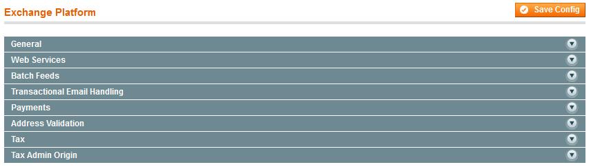

# Installing and Configuration the eBay Enterprise Exchange Platform Magento Extension

## Contents

1. [Prerequisites and System Requirements](#prerequisites-and-system-requirements)
1. [Installation](#installation)
1. [Configuration](#configuration)
  1. [Local XML Configuration](#local-xml-configuration)
	1. [Payment Bridge Installation and Configuration](#payment-bridge-installation-and-configuration)
	1. [Admin Configuration](#admin-configuration)

## Prerequisites and System Requirements

### Intended Audience

The intended audience for this guide is System Integrators with extensive experience with Magento as well as programming experience, especially with XML.

### System Prerequisites

- The eBay Enterprise Exchange is compatible with Magento EE 1.13.1 and later. If you’re running an earlier version of EE, see [Upgrading to and Verifying Magento Community Edition 1.8 and Enterprise Edition 1.13&mdash;Part 1](http://www.magentocommerce.com/knowledge-base/entry/ce18-and-ee113-upgrading).
- The extension requires [a patch](../deploy/address.validation.patch) to core Magento’s Address Model so that the address validation service can work effectively. If you do not have this patch, please contact eBay Enterprise.
- In addition to [Magento’s standard system requirements](http://magento.com/resources/system-requirements) the eBay Enterprise Exchange Platform Magento Extension requires the XSL extension to PHP. (While [PHP documentation](http://www.php.net/manual/en/xsl.installation.php) states that PHP 5 includes the extension by default, our experience has been that it is not installed with php on many GNU/Linux systems such as Debian and Ubuntu.)
- The Magento Payment Bridge must be set up in a secure environment that is [Payment Application Data Security Standard (PA DSS) compliant](https://www.pcisecuritystandards.org/documents/pa-dss_v2.pdf)
- The extension has been tested with PHP 5.3. 

### Required Information

You must have the following information from eBay Enterprise to start using the Exchange Platform:

- The eBay Enterprise mapping for the Magento shipping method (a typical Magento shipping method is `flatrate_flatrate`)
- Valid number ranges for all the stored value cards your store accepts
- API key
- Store code

If you don’t have all of this information, contact eBay Enterprise before continuing.

### Payment Bridge Documentation

The Magento Payment Bridge is available on the [Magento support portal](http://magento.com):
- In the upper right corner, click *My Account*.
- Log in with the credentials provided to you by Magento Support.
- In the left navigation bar, click *Downloads*.
- In the right pane, click *Magento Payment Bridge*. The following figure shows an example. 
- Click *Download* next to the document to download.

## Installation

1. Download the eBay Exchange Platform tarball file from the eBay Enterprise partner portal.
1. Log in to the Magento Admin Panel as an administrator.
1. Click System → Magento Connect → Magento Connect Manager.
1. Log in to the Magento Connect Manager as an administrator.
1. On the Extensions tab page, click **Browse** in the Direct package file upload section. The following figure shows an example. 
1. Locate the eBay Exchange Platform tarball tarball on your local filesystem.
1. Click **Upload**. A successful installation displays as follows. 

### If the eBay Exchange Platform installed successfully:

1. Log out of the Magento Connect Manager.
1. Log out of the Magento Admin Panel.
1. Secure the Magento file system as discussed in [After You Install Magento: Recommended File System Ownership and Privileges](http://www.magentocommerce.com/knowledge-base/entry/install-privs-after).

### The following error might display instead:

> CONNECT ERROR: The 'community' channel is not installed. Please use the MAGE shell script to install the 'community' channel.

If the preceding error displays, use the following step

1. Log in to the Magento server and open a command prompt window.
1. Change to your Magento install directory (for example, `/var/www/html/magento`).
1. Run the following command: `chmod +x mage && ./mage mage-setup`.
1. Log out of the Magento Connect Manager.
1. Log back in to the Magento Connect Manager as an administrator.
1. Install the eBay Exchange Platform again.
1. After you have installed and verified the eBay Platform Exchange extension, secure the Magento file system as discussed in [After You Install Magento: Recommended File System Ownership and Privileges](http://www.magentocommerce.com/knowledge-base/entry/install-privs-after).

### Verifying the eBay Exchange Platform Extension

To verify the eBay Exchange Platform extension installed successfully, log in to the Magento Admin Panel and look for configuration options under System → Configuration → EBAY ENTERPRISE as follows:
1. Log in to the Magento Admin Panel as an administrator.
1. Click **System** → **Configuration**.
1. In the left navigation bar, look for EBAY ENTERPRISE between SALES and SERVICES.
1. Click EBAY ENTERPRISE → **Exchange Platform**. The following figure shows the options that display in the right pane.  If these options do *not* display:
  1. If a 404 (Not Found) error displays, log out of the Admin Panel and log back in.
	1. Flush the Magento cache
1. If the preceding options do not display, contact eBay Enterprise for support.
1. After you have installed and verified the eBay Platform Exchange extension, secure the Magento file system as discussed in [After You Install Magento: Recommended File System Ownership and Privileges](http://www.magentocommerce.com/knowledge-base/entry/install-privs-after).

## Configuration

### Local XML Configuration

The eBay Exchange Platformrsquo;s ships with a sample extension configuration file—*magento-install-dir*/app/etc/e2bc.xml.sample—that enables you to specify options such as:
- eBay Enterprise Exchange mapping for the Magento shipping method.
- Stored value card number ranges.
- Whether or not to delete feed files on the eBay Enterprise server after they have been read.
Except for the option to delete feed files, all values are provided to you by eBay Enterprise.
`e2bc.xml.sample` provided with the extension follows.

  1. [Local XML Configuration](#local-xml-configuration)
	1. [Payment Bridge Installation and Configuration](#payment-bridge-installation-and-configuration)
	1. [Admin Configuration](#admin-configuration)
## Configuring eb2c.xml

The eBay Exchange Platformrsquo;s ships with a sample extension configuration file&mdash;<em>magento-install-dir</em>/app/etc/e2bc.xml.sample&mdash;that enables you to specify options such as:
- eBay Enterprise Exchange mapping for the Magento shipping method.
- Stored value card number ranges.
- Whether or not to delete feed files on the eBay Enterprise server after they have been read.
Except for the option to delete feed files, all values are provided to you by eBay Enterprise.
`e2bc.xml.sample` provided with the extension follows.

To configure the eBay Exchange Platform extension:

<ol>
<li>Log in to your Magento server as a user with ownership of the Magento file system.</li>
<li>Navigate to app/etc in your Magento install and copy the eb2c.xml.sample file into eb2c.xml.</li>
<li>Edit eb2c.xml, including the following information:
<table>
<thead>
	<tr><th>Element</th><th>Subelement</th><th>Default value</th><th>Valid values</th></tr>
</thead>
<tbody>
	<tr><td>&lt;shipmap></td><td>&lt;flatrate_flatrate></td><td>ANY_STD</td><td>Maps the Magento shipping method to an eBay Enterprise shipping method (a typical Magento shipping method is `flatrate_flatrate`). Enter the value provided to you by eBay Enterprise.</td></tr>
	<tr><td>&lt;payment></td><td>&lt;svc_bin_range></td><td>&lt;GS>800199900000000&ndash;800199910000000&lt;/GS> &lt;SP>6006592800000000000&ndash;6006592800100000000&lt;/SP> &lt;SV>6969280000000000&ndash;6969280010000000&lt;/SV> &lt;VL>9900000000000000&ndash;9900000010000000&lt;/VL></td><td>For each type of card you accept, enter the card number range to validate. These values are provided by eBay Enterprise.</td></tr>
	<tr><td>&lt;delete_remote_feed_files></td><td>n/a</td><td>1</td><td><li>0 to leave the feed XML files on the eBay Enterprise server after they have been processed.</li><li>1 to delete the feed XML files after they have been processed. This setting is recommended to save space on the eBay Enterprise server. Regardless of this setting, feed XML files remain on your Magento server so they can be recovered later, if needed.</li></td></tr>
</tbody></table></li>
<li>Save your changes to `e2bc.xml`.</li>
</ol>

## Configuring the Magento Payment Bridge and eBay Enterprise Exchange Payments

This section discusses the steps you must perform to:

- Configure the Payment Bridge to use the eBay Enterprise Credit Card as a payment method. For more information about configuring the Payment Bridge, see the documentation discussed in [Payment Bridge Documentation](#prereq-related). Before you configure the Payment Bridge, you must configure other eBay Enterprise Exchange Platform options (including **System** > **Configuration** > EBAY ENTERPRISE > **eBay Exchange Platform** > **Tax Admin Origin**). For more information, see the *eBay Enterprise Exchange Platform Installation and Administration Guide*.
- Configure eBay Enterprise Exchange payments options in the Admin Panel.
- Configure the Payment Bridge using the command line.

### Configuring Payment Bridge Options in the Admin Panel
This section discusses how to set up eBay Enterprise Credit Card options in the Admin Panel.
To set up Payment Bridge options in the Admin Panel:
1. Log in to the Magento Admin Panel as an administrator.
2. Click **System** > **Configuration** > SALES > **Payment Methods**.
3. In the right pane, click <strong>eBay Enterprise Credit Card</strong> to expand it. The following figure shows an example. 
4. To change the scope of your settings, from the **Current Configuration Scope** list on the left, click the appropriate option. For example, to configure options for store view scope, click the name of a store view.
- Enter the following information.
<table>
<tbody>
<tr class="table-headings">
  <th>Option</th>
  <th>Scope</th>
  <th>Description</th>
<tr class="even">
  <td>Enabled list</td>
  <td>Website</td>
  <td>From the list, click <strong>Yes</strong> to enable the eBay Enterprise Credit Card payment method.</td>
</tr>
<tr class="odd">
  <td>Title field</td>
  <td>Store View</td>
  <td>Enter the payment method name as you wish it to display on the storefront; for example, `eBay Enterprise Credit Card`.</td>
</tr>
<tr class="even">
  <td>Payment From Applicable Countries list</td>
  <td>Website</td>
  <td>From the list, one of the following:
  <li><strong>All Allowed Countries</strong> to accept eBay Enterprise Credit card payments from all countries for which this website is configured.</li>
  <li><strong>Specific Countries</strong> to accept payments from countries you choose.</li></td>
</tr>
<tr class="odd">
  <td>Payment from Specific Countries list</td>
  <td>Website</td>
  <td>Click the name of each country from which to accept eBay Enterprise Credit card payments for this website. (Hold down the Control key while clicking.)</td>
</tr>
  <td>Sort Order field</td>
  <td>Website</td>
  <td>This field has no effect; leave it blank.</td>
</tr>
</tbody></table></li></ol>

### Configuring eBay Exchange Platform Payments
This section discusses how to configure eBay Payments. The next section discusses how to configure eBay Enterprise Credit Card payments.
To configure your Magento server to use the eBay Enterprise cloud service:
<ol><li>Log in to the Magento Admin Panel as an administrator.</li>
- Click <strong>System</strong> > <strong>Configuration</strong> > EBAY ENTERPRISE > <strong>Exchange Platform</strong>.</li>
- To change the scope of your settings, from the <strong>Current Configuration Scope</strong> list on the left, click the appropriate option. For example, to configure options for store view scope, click the name of a store view.</li>
- In the right pane, click the <strong>Payments</strong> tab to expand it.</li>
- Enter or edit the following information:
<table>
<tbody>
<tr class="table-headings">
  <th>List</th>
  <th>Scope</th>
  <th>Description</th>
<tr class="even">
  <td>Enable Payments</td>
  <td>Store View</td>
  <td>From the list, click <strong>Yes</strong> to enable eBay Enterprise Payments to securely process payments for a particular store view. The default is <strong>No</strong>.</td>
</tr>
<tr class="odd">
  <td>Enable Credit Card</td>
  <td>Store View</td>
  <td>From the list, click <strong>Yes</strong> to securely process credit card transactions using eBay Exchange. 
  <strong>Important</strong>: Save the configuration before you click <strong>Configure Payment Bridge</strong>; otherwise, all configuration changes will be lost. To save the configuration, click <strong>Save Config</strong> at the top of the page. 
  The default is <strong>No</strong>, which means you do not use the eBay Enterprise Credit Card.</td>
</tr>
<tr class="even">
  <td>Enable PayPal Express</td>
  <td>Store View</td>
  <td>From the list, click <strong>Yes</strong> to use eBay Enterprise Payments to securely process credit card transactions on the store view. 
  The default option is <strong>No</strong>, which means you do not use PayPal Express.</td>
</tr>
<tr class="odd">
  <td>PayPal Shortcut on Shopping Cart</td>
  <td>Store View</td>
  <td>From the list, click <strong>Yes</strong> to display the PayPal logo on the shopping cart, which makes it simpler for users to check out using PayPal. 
  The default option, <strong>No</strong>, means PayPal is available at checkout with the other payment options.</td>
</tr>
<tr class="even">
  <td>PayPal Shortcut on Product View</td>
  <td>Store View</td>
  <td>From the list, click <strong>Yes</strong> to display the PayPal logo on the product view page, which makes it simpler for users to check out using PayPal. 
  The default option, <strong>No</strong>, means PayPal is available at checkout with the other payment options.</td>
</tr>
<tr class="odd">
  <td>PayPal Sandbox Mode</td>
  <td>Website</td>
  <td>Click <strong>Yes</strong> to use the PayPal to process test transactions. This choice is appropriate for testing payment processing only. 
  The default option, <strong>No</strong>, is appropriate for a live storefront.</td>
</tr>
</tbody></table></li>
- At the top of the page, click <strong>Save Config</strong>.</li></ol>

### Configuring Payment Bridge Options Using the Command Line

You need the following information:
- Merchant code
- API key
- Store code
The merchant code was provided to you by Magento. The API key and store code were provided to you by eBay Enterprise.
To configure the Payment Bridge:
<ol><li>Log in to the Magento server as a user with ownership of the Magento file system.</li>
- Enter the following commands in the order shown:
<pre>cd <em>magento-install-dir</em>/tools
php merchant.php --pgc <em>merchant-code</em></pre></li>
<!-- <li>Enter the following commands in the order shown:
<pre>cd <em>magento-install-dir</em>/tools
php merchant.php -i <em>merchant-code</em></pre> 
The `-i` option displays all the information you need to configure the Payment Bridge.</li> -->
<!-- <pre>php merchant.php --pgc <em>merchant-code</em></pre></li> -->
- When prompted, select the following options:
- GSI Credit Card payment method (also identified by the string `eb2cpayment_cc`)</li>
- API key provided by eBay Enterprise 
(This is the same API key.)
- Store code provided by eBay Enterprise
- Allowed credit card types
- Whether or not to require a credit card verification number (also referred to as <em>CVV</em>)
- Transaction ID prefix (leave this option blank)
- Follow the prompts on your screen to finish and save the configuration.</ol>

## Scheduling Batch Feeds
The eBay Enterprise Exchange Platform uses your Magento EE cron job to update feeds every 15 minutes. Provided your cron job is set up, there is no additional configuration required.
For more information about setting up your Magento cron job, see <a href="http://www.magentocommerce.com/knowledge-base/entry/ce18-and-ee113-installing#install-cron" target="_blank">Setting Up Cron Jobs</a>.

