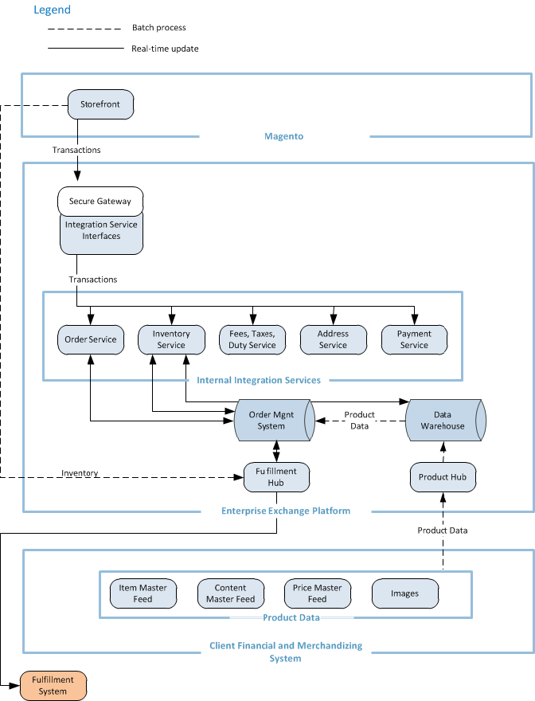
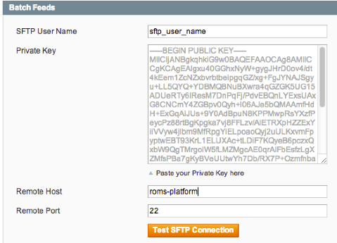
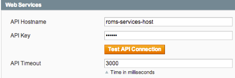
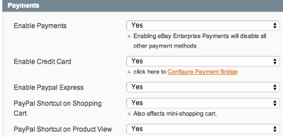
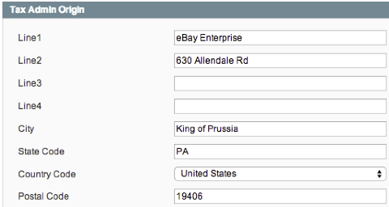
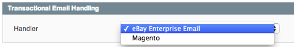
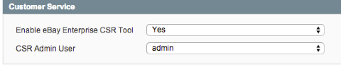

#Retail Order Management (ROM) Magento Extension Overview of Business Features

##Contents
- [Intended Audience](#intended-audience)
- [Introduction](#introduction)
- [Data Flows](#data-flows)
  - [Checkout](#checkout-flow)
  - [Data Flow Diagram](#data-flow-diagram)
- [Configuration](#configuration)
  - [Data Feeds Configuration](#data-feeds-configuration)
  - [Services Configuration](#services-configuration)
  - [Modes: _Import_ or _Export_](#modes-_import_-or-_export_)
- [Features and Capabilities](#features-and-capabilities)
  - [Order Services](#order-services)
  - [Product Management](#product-management)
  - [Inventory Management](#inventory-management)
  - [Payment Processing](#payment-processing)
  - [Fraud Management](#fraud-management)
  - [Tax, Duties and Fees](#tax-duties-and-fees)
  - [Address Validation](/src/app/code/community/EbayEnterprise/Address/README.md)
  - [Transactional Emails](#transactional-emails)
  - [Customer Service](#customer-service)
  - [Custom Order Attributes](#custom-order-attributes)
  - [Gift Wrap and Messaging](ROM_GIFTWRAP_MODULE.md)

##Intended Audience
This document is intended to provide a systems integrator with a high level overview of the features provided by the ROM Magento Extension.

The document is illustrated with several ROM Extension Configuration examples, in order to help tie a business feature to a concrete concept in the extension. It is hoped that this will provide the reader with a general sense of the simplicity of the configuration as it relates to the sophisticated features the extension enables.

##Introduction
eBay Enterprise's Retail Order Management System (ROMS) is an industry leading set of omnichannel enabling capabilities, services and infrastructure including:

* Distributed order management
* Omnichannel inventory management
* Payment processing
* Fraud management
* Advanced reporting

The ROM Magento Extension seamlessly delivers these features to the Magento Platform with a single source solution.

##Data Flows
Data flows to and from a Magento Platform in two forms:

1. Data Feeds, processed on a cron schedule
2. Realtime API Services during the shopping experience.

### Checkout Flow
Generally speaking, a typical ROM Extension shopping session flows as follows:

1. As items are added to cart, the Inventory Service is called to ensure quantity available.
2. Address Validation is called to validate customer's addresses.
3. Tax, Duty and Fee Service is called to ensure accurate tax collection.
4. Payments Services is called to capture payment.
5. Order Service is called to submit the order for fulfillment.

The ROM Extension will automatically reverse payments and allocations, if necessary, when a failure occurs. For example, if a payment method is rejected, the ROM Extension automatically returns any allocations back to inventory.

### Data Flow Diagram

##General Configuration Overview
The ROMS platform extends its capabilities to Magento via a combination of Service APIs and Data Feeds. For a complete description and details about how to configure the extension, please refer to [Installation and Configuration of the eBay Enterprise Retail Order Management Magento Extension](INSTALL.md).

###Data Feeds Configuration
Data Feeds include product details, images, inventory information and pricing.

###Services Configuration
The Web Services that enable services such as Real Time Inventory Allocation are provided by an API, configured thus:

###Modes: _Import_ or _Export_
A Magento site operates in either _Import_ or _Export_ mode. This is an XML configuration item, and both modes are detailed in external documents as noted:

* In _Import_ mode, the ROMS platform is the system of record: ROMS sends Item, Content and Pricing information _to_ the Magento platform in the form of data feeds. For a complete description and details about how to configure _Import_ mode, please refer to [Product Import](PRODUCT_IMPORT.md).

* In _Export_ mode, the Magento platform is the system of record: the Magento store sends data to the ROMS Platform. For a complete description and details about how to configure _Export_ mode, please refer to [Magento as a Product Information Management System](PRODUCT_EXPORT.md).

##Features and Capabilities
Regardless of the mode of operation, the ROM Extension enables all of the following features on the Magento platform.

### Order Services
* Orders are accepted realtime into ROMS from the Magento store.
* Fail orders will be resubmitted into ROMS via an automated cron job.
* Customer order history for registered users and guest order search is pulled from ROMS in realtime.

###Product Management
In an _Import_ mode Magento store, product data, images, pricing information and content are published to the Magento store. All data is automatically updated.

In an _Export_ mode Magento store, the Magento store exports its data as a series of feeds which are sent to the ROMS host.

###Inventory Management
Inventory Management consists of an _Availability To Promise (ATP) Feed_ and an _Inventory Service_.

The _ATP Inventory Feed_ provides

* the initial inventory quantities for all SKUs.
* a complete feed on a daily basis with correct inventory levels.
* an incremental feed as often as half-hourly (depending upon configuration), to account for warehouse receipts and other adjustments that may occur throughout the day.

The _Inventory Service_ provides

* Real time validation of inventory available as products are added to a Magento cart. The amount of time to cache the validated quantity is configurable.
* Real time _allocation_ upon order submission.
* Real time _rollback_ of inventory in the event that a order submission fails (e.g., payment failed).

###Payment Processing

A single, simplified, secure high-volume PCI-DSS Level 1 compliant processing engine that eliminates the need for multiple different configurations.

Payment Service offers automatic updates and seamless processor additions without disturbing Magento store code or configuration.

###Fraud Management
Automatically collected fraud analysis data is submitted with each order. Industry leading, precise screening leads to fewer false positives and minimizes order delays and cancellations.

###Taxes, Duties and Fees
Centralize and secure calculation and processing of taxes, duties and fees.

* Accurate tax calculations
* Ongoing updates to tax nexus, rates, rules and regulations
* Sales and use tax calculations for shipping to and within the US and Canada.
* Full VAT collection support for EU

###Transactional Emails
Transactional emails can either be handled by the local Magento site, or you can elect to have emails handled by the ROMS platform, further reducing the complexity of running the Magento store.

###Customer Service
Customer Service Call Center enables simple and direct Order Service capabilities to be carried out for phone-in customers. Orders can be placed, updated, and canceled via the interface.

###Custom Order Attributes
Custom Attributes are fully supported at any level

*  _Order_ level.
*  Order _Context_ level.
*  Order _Item_ level.

A simple XML mapping configuration allows Order Attributes to be handled end to end.  For a complete description and details about how to configure Custom Order Attributes, please refer to [Mapping Order Create Custom Attributes](ORDER_CUSTOM_ATTRIBUTES.md).

