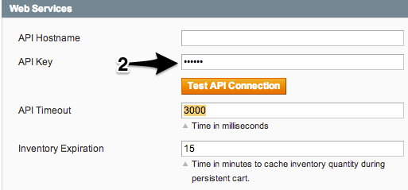
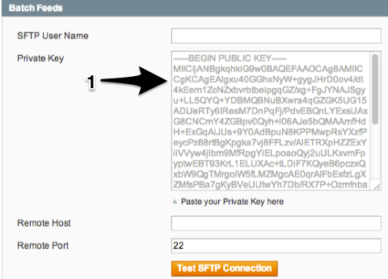

**Magento Retail Order Management Extension**
# Troubleshooting Guide

The intended audience for this guide is Magento system integrators. You should review the [Magento Retail Order Management Extension Overview](OVERVIEW.md) and [Installation and Configuration Guide](INSTALL.md) before proceeding.

## Contents

- [Common Configuration Problems](#common-configuration-problems)
  - [Web Services](#web-services)
  - [SFTP Credentials](#sftp-credentials)
- [Using the System and Exception Logs](#using-the-system-and-exception-logs)

## Common Configuration Problems

Configuration issues are the most common cause of problems.

### Web Services

The API Key is obscured, so the only way to ensure it is correct is to use the "Test API Connection" button.

### SFTP Credentials

The private key must be pasted as-is, with newlines. Note that the Public Key is displayed as soon as the private key is correctly installed. Use the "Test SFTP Connection" button to ensure you are able to connect.

## Using the System and Exception Logs

Troubleshooting typically involves reviewing configuration options and occasionally enabling logging in order to review system and exception logs.

By default, Magento ships with logging turned off. During system implementation, setting the Log Level to `INFO` should suffice. `DEBUG` is intended for system developers, and is extremely verbose - it may introduce more noise into the logs than desired for most needs.

- - -
Copyright © 2014 eBay Enterprise, Inc.
