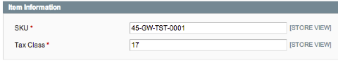

#Retail Order Management (ROM) Magento Extension Gift Wrap Module

- [Retail Order Management (ROM) Magento Extension Gift Wrap Module](#retail-order-management-rom-magento-extension-gift-wrap-module)
  - [Introduction](#introduction)
  - [Known Limitations](#known-limitations)
  - [Importing Gift Wrap](#importing-gift-wrap)
    - [Gift Wrapping Attribute Mappings](#gift-wrapping-attribute-mappings)
  - [Magento Admin](#magento-admin)

## Introduction
The Gift Wrap Module for the ROM Magento Extension adds ROM Gift Wrap management features to a Magento installation.

These features include offering gift wrap at the order and item level. Taxes, Duties and Fees are also calculated as applicable.

## Known Limitations
Magento supports images for Gift Wrap. ROM does not. Images must be added via Magento's admin panel, or by a default mapping (see [Gift Wrapping Attribute Mappings](#gift-wrapping-attribute-mappings) for details).

## Importing Gift Wrap
Gift Wrap is specified in the ItemMaster feed by specifying the ```giftwrap``` as the ItemType in an Item node. Please note that the ```ClientItemId``` should be 12 or fewer characters to allow for the catalog id prefix.


```xml

	<Item>
		<ItemId>
			<ClientItemId>GW-TST-0001</ClientItemId>
		</ItemId>
		<BaseAttributes>
			<ItemDescription>Gift Wrap product 1</ItemDescription>
			<ItemType>GiftWrap</ItemType>
			<TaxCode>17</TaxCode>
		</BaseAttributes>
		<ExtendedAttributes>
			<Price>10.95</Price>
		</ExtendedAttributes>
	</Item>

```


### Gift Wrapping Attribute Mappings

The following values map feed values into Magento Gift Wrap attributes.

The ```dummy``` node allows you to specify default values. The ```<image>``` node is of particular interest as it will allow you to specify a default image, as none is provided from ROM.

For the ```import_attribute_mappings```, the defaul mappings provided by the module will more than likely suffice for most use cases.


```xml

<default>
			<dummy>
				<!-- Default values for Gift Wrapping attributes where Magento doesn't already have defaults. -->
				<eb2c_tax_class>17</eb2c_tax_class>
				<base_price>0</base_price>
				<image></image>
				<status>1</status>
			</dummy>
			<import_attribute_mappings>
				<design>
					<class>eb2cproduct/map</class>
					<type>helper</type>
					<method>extractStringValue</method>
					<xpath>BaseAttributes/ItemDescription</xpath>
				</design>
				<status>
					<class>eb2cproduct/map</class>
					<type>helper</type>
					<method>passThrough</method>
					<xpath>1</xpath>
				</status>
				<base_price>
					<class>eb2cproduct/map</class>
					<type>helper</type>
					<method>extractFloatValue</method>
					<xpath>ExtendedAttributes/Price</xpath>
				</base_price>
				<image>
					<class>eb2cproduct/map</class>
					<type>disabled</type>
					<method>passThrough</method>
					<xpath></xpath>
				</image>
				<eb2c_sku>
					<class>eb2cproduct/map</class>
					<type>helper</type>
					<method>extractSkuValue</method>
					<xpath>ItemId/ClientItemId</xpath>
				</eb2c_sku>
				<eb2c_tax_class>
					<class>eb2cproduct/map</class>
					<type>helper</type>
					<method>extractStringValue</method>
					<xpath>BaseAttributes/TaxCode</xpath>
				</eb2c_tax_class>
			</import_attribute_mappings>
	</default>

```

The following table describes how elements in the XML gift wrapping feeds are imported and used by Magento.

*All XPath expressions are relative to the repeating XML node representing a single gift wrapping in the feed, e.g. `Item` in ItemMaster.*

<table>
	<thead>
		<tr>
			<th>XPath</th>
			<th>Description</th>
			<th>Lang Support</th>
		</tr>
	</thead>
	<tbody>
		<tr>
			<th colspan="3">ItemMaster</th>
		</tr>
		<tr>
			<td>BaseAttributes/ItemDescription</td>
			<td>Design of the Enterprise Gift Wrapping in Magento. This is the descriptive name that appears during checkout when Gift Wrap is selected.</td>
			<td>No</td>
		</tr>
		<tr>
			<td>1</td>
			<td>Status of the Enterprise Gift Wrapping in Magento will always be set to the literal value '1'</td>
			<td>No</td>
		</tr>
		<tr>
			<td>ExtendedAttributes/Price</td>
			<td>Base Price of the Enterprise Gift Wrapping in Magento.</td>
			<td>No</td>
		</tr>
		<tr>
			<td></td>
			<td>Image of the Enterprise Gift Wrapping in Magento is currently disabled as ROM does not support it.</td>
			<td>No</td>
		</tr>
		<tr>
			<td>ItemId/ClientItemId</td>
			<td>The Gift Wrap module installs a new field, SKU, the identifier by which the Gift Wrap is known to ROM for the various ROM services (Taxes, Order Create, etc.)</td>
			<td>No</td>
		</tr>
		<tr>
			<td>BaseAttributes/TaxCode</td>
			<td>The Gift Wrap module installs a new field, Tax Class, which is needed for sending Tax Duty Quote Request for gifting nodes.</td>
			<td>No</td>
		</tr>
	</tbody>
</table>

## Magento Admin
To support full gift wrapping features of ROM, two fields are added to the Magento admin panel as shown. These fields appear on the Sales > Gift Wrapping > Edit panel.


